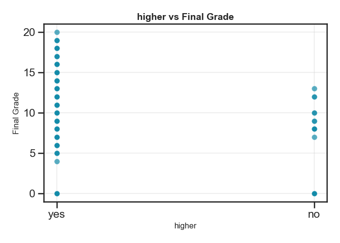
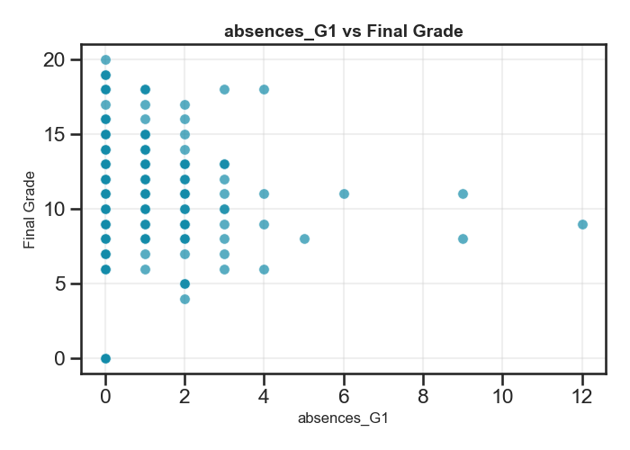

# Student Performance Predictions using Machine Learning 

## Project Summary & Problem Framing
This project analyzes data from a Portuguese school system, and creates machine learning models to predict student's performance. These data will help school administrators make more informed decisions about which students need more assistance in order to achieve better learning outcomes.

A subset of features were selected from the original dataset to reduce complexity and help improve model performance. The features selected for this analysis include:
- student absences from previous terms
- grades from previous terms
- whether students have aspirations of higher education
- whether students have access to internet
- the quality of the student's family relationships (scored 1-5) 

The anaylsis trains two sets of machine learning models: one with grades from the previous two terms (G1 and G2) and one without grades from the previous two terms.

The results of the analysis suggest a simple linear regression model including grades from the previous two terms is the best fit for predicting future student performance.

## Data Overview
The data were sourced from UC Irvine's [machine learning repository](https://archive.ics.uci.edu/dataset/320/student+performance). The dataset contains information collected from school reports and surveys about students performance in two Portuguese schools.

The target variable the analysis is predicting is the student's final grade. A preview of the correlations between the target variable and the other features, shows a strong positive correlation between the student's final grade and their grades from previous terms (G1 and G2).

The G1 and G2 grades are highly correlated with the final grade scores (G3), but the analysis creates two different machine learning models with and without the G1 and G2 grades because the model without grades could be used to make predictions earlier in the year.

## Analytical Insight
While exploring the initial dataset and visualizing the relationships between each of the features in the data against the final grades, it was clear the G1 and G2 data points representing grades from previous school terms, were strongly correlated with the predicted value of final grades.

#### *Scatter plot showing G1 vs final grades*

#### *Scatter plot showing G2 vs final grades*

In addition to that, the exploratory data showed an interesting relationship between the student's aspirations to pursue higher education and their final grades, and so it was included in the analysis as a potential factor that would affect final grades. There were significantly more 'yes' responses in the higher education category, indicating that most students in the dataset intend to pursue higher education. In comparison, the group that is interested in higher education has final grade scores that are higher and span a larger set of values than the the group that responded 'no'.

#### *Plot showing higher education goals vs final grades*

Similarly, the exploratory data uncovered an interesting relationship between student's access to internet and their final grades. It appears there are fewer student without internet access at home than students with internet access, but those without internet have final grade scores more concentrated in the mid-range. Whether or not a student has access to internet at home could be a big factor in their final grade score, so this feature was included in the models.

#### *Plot showing internet access vs final grades*

Other features included in the models are the number of absences from previous terms as well as the student's family relationship score. The number of absenses was included because missing a significant number of days in the school year could impact student's ability to achieve higher final grades. From looking at the data, it's clear that the students with the higher final grades missed fewer days than those who had more absences.

#### *Plot showing absences from G1 term vs final grades*

Additionally, the student's familiy relationship score was included in the models since the student's home life could influence their ability to focus on their school work. The data show that most respondents scored their relationships with their family between 3 and 5, but there are higher final grades for those who reported better relationships with their family.

#### *Plot showing student family relationships vs final grades*

## Methodology
The analysis trained a few different types of machine learning models in order to determine which one is a best fit for the dataset including: Linear Regression, SVM Regression, and Lasso Regression. 

Linear Regression models attempt to find a line of best fit to predict a dependent variable (like final grades), using a set of independent variables (like absences, internet access, etc). In contrast, SVM Regression models offer more flexibiliy by allowing for a certain margin of error, and then create a line of best fit including the margin of error on both sides of the line. Points within the margins are considered close enough, and the goal is to minimize outliers outside the margins. Finally, to make the process simpler, Lasso Regression is a type of linear regression that can be used to simplify the model by removing unimportant features.

For each dataset, two regression models were trained on the transformed data: one including G1 and G2 scores, and one excluding them. 

Each model was evaluated against two metrics, RMSE scores and R^2 scores, to identify which one performs best on the data. RMSE scores represent an average of how much the model's predicted values differ from the actual values, so lower scores indicate better accuracy. The best possible score for R^2 scores is 1 and it can be negative if the model's predictions are worse than a random guess.

## Key Results
The RMSE scores were calculated for each of the regression models with and without the G1 and G2 grades data.

| Model                | With Grades (RMSE)  | Without Grades (RMSE)  |
|----------------------|---------------------|------------------------|
| Linear Regression    | 1.8749              | 4.4971                 |
| SVM Regression       | 2.2399              | 4.5476                 |
| Lasso Regression     | 2.2399              | 4.5311                 |

Given that lower RMSE scores indicate better accuracy between the predicted values and the actual values on average, the clear winner is the Linear Regression model with the G1 and G2 grades data included.

In addition, the analysis finetunes the hyperparameters of the SVM Regression model, test it against the test dataset, and calculate RMSE and R^2 scores.

| Model                | RMSE Score          | R^2 Score              |
|----------------------|---------------------|------------------------|
| SVM Regression       | 2.1032              | 0.7842                 |

The R^2 score indicates the model explains roughly 78% of variability in the data, and while this is a decent start, next steps should be continuing to finetune the hyperparameters of the SVM Regression model and seeing if finetuning can produce a model with a lower RMSE score and higher R^2 score. 

At this point, the recommendation is to try improving each of the regression models by tuning hyperparameters and evaluate them against the test dataset to see how they perform against new datasets. For each model, calculate the RMSE and R^2 values to see if any of them can produce a result with higher confidence. If none of those models show improvements to the RMSE and R^2 scores, the recommendation would be to explore a DecisionTree model.

## Conclusion
The analysis takes a series of regression models with and without the G1 and G2 grades data and determines the best fit is the Linear Regression model with G1 and G2 grades. It proves that G1 and G2 grades from previous terms are significant predictors of the student's final grade.

The regression models without the G1 and G2 grades data produced poor RMSE and R^2 scores. Even when trying to finetune the hyperparameter of the SVM Regression, the results of the R^2 score proved it performed worse than a random guess, further proving the importance of including the G1 and G2 grades.

The next steps based on the analysis would be to continue finetuning the regressions, and implement a DecisionTree model if the regressions do not show improvements in RMSE and R^2 scores.
